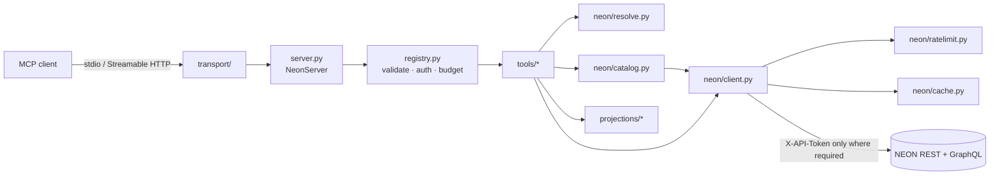

# Architecture

| Module | Role |
| --- | --- |
| `__main__.py` | CLI: flags → config → logging → serve; `--check`, `--print-config` |
| `config.py` | pydantic settings; flag > `NEON_MCP_*` env > YAML > defaults; token fallbacks |
| `server.py` | the only SDK-coupled module: `tools/list` (sorted, 2020-12 schemas, cache hints), `tools/call` (text + `structuredContent` + upstream `_meta`), MRTR, resources, prompts |
| `registry.py` | `@register_tool`, argument validation, fail-fast `auth_required`, result budget (`fit_to_budget`), `requestState` codec |
| `context.py` | `ToolContext` handed to handlers; request-scoped context variables |
| `errors.py` | `ToolError` codes and the NEON error mapping (400 "not found" → `not_found`) |
| `neon/client.py` | one `httpx` client: token placement, retries, redirects via the host allow-list, envelope unwrapping |
| `neon/ratelimit.py`, `neon/cache.py` | per-identity token buckets; TTL cache with single-flight, refresh-ahead, stale-if-error |
| `neon/catalog.py` | GraphQL-first product/site indexes (REST fallback, circuit breaker), availability, batched locations |
| `neon/resolve.py` | code-or-name resolution with an acceptance margin |
| `neon/filenames.py`, `neon/downloads.py` | NEON file-name grammar; confined plan-before-transfer downloads |
| `projections/` | NEON payloads → compact output models (NEON camelCase keys, month ranges, paging) |
| `tools/` | one module per family; each handler is `async (args, ctx) -> Model` |
| `resources.py`, `prompts.py`, `resources_static/` | `neon://` resources, templates and prompts |
| `transport/` | stdio; stateless Streamable HTTP with `/healthz`, `/readyz` and a request-context middleware |

Design decisions and their reasons are recorded in `DESIGN.md` and `RESEARCH.md` at
the repository root.
